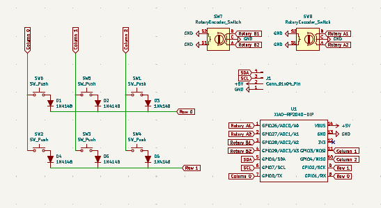
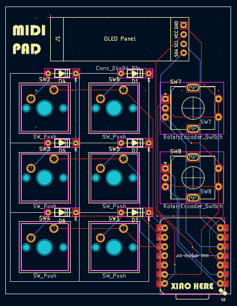
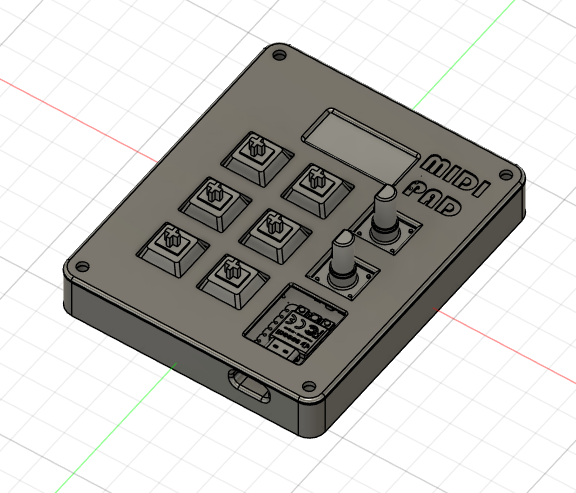

<h1>
   
  MIDIPad
   
</h1>

This little midipad will help me access easily some of my music production software's functionalities.

## Schematic and PCB

I designed it with Kicad:

Schematic:

 

 

PCB:

## Case

The case includes:

- 3D printed parts: a base and a top cover
- Assembled with 4x M3 bolts and 4x M3 heatset inserts

Designed in Fusion 360:

## BOM

- 6x Cherry MX Switches
- 6x Keycaps
- 4x M3x5x4 Heatset Inserts
- 4x M3 Bolts
- 1x 128x32 0.91" OLED Display
- 2x EC11 Rotary Encoders
- 1x XIAO RP2040
- 1x Case (2 printed parts)